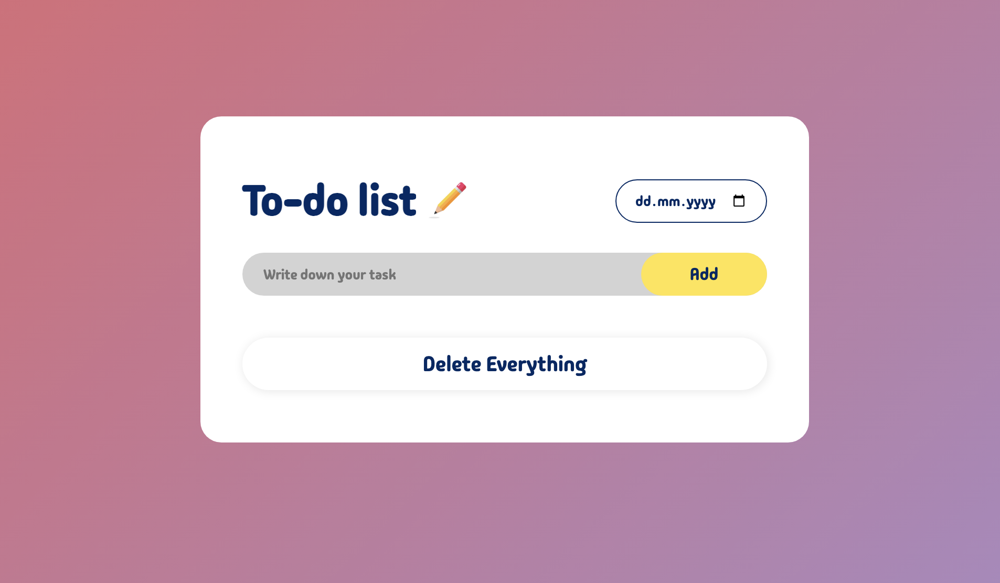

<h1 align="center">

<br>
To-Do List
<br>
</h1>
<h4 align="center">A minimal JavaScript To-Do List App</h4>



## Run the App

In the project directory, you can run: 
```sh
open index.html
```

## Information about the project

To-Do List App is a simple app, where you can write down all the tasks you need to complete. You can type your task in a searchbar and add it to the list, then manage it by marking it as a complete/uncomplete and ultimately deleting it when necessary. This project might be useful if you want to manage you daily tasks efficiently.

###  Features: 
* pick a date from the calendar
* add new task
* mark task as complete/uncomplete
* delete single task
* delete all tasks

## This project was built with:
* JavaScript
* HTML
* CSS
